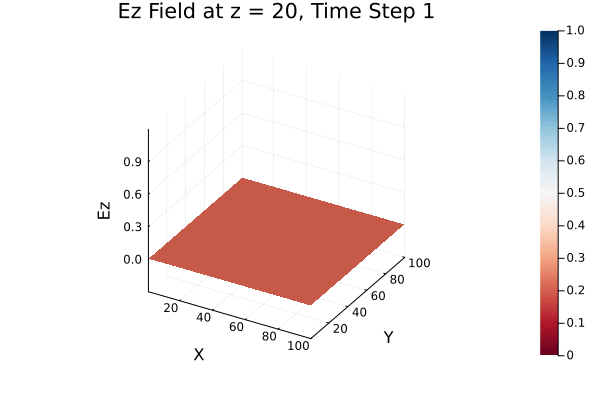

# Development of EM analysis tools

## Julia
---

### FDTD
Algorithms developed so far are based on work from:
[1] D. M. Sullivan, Electromagnetic Simulation Using The FDTD Method. 
    IEEE Press Series on Electromagnetic Wave Theory. Wiley-IEEE Press, 2013.

## Todo
---

- [ ] parameterize functions for 2D and 3D fdtd codes
- [ ] Do time performance analysis of functions
- [ ] GPU acceleration?